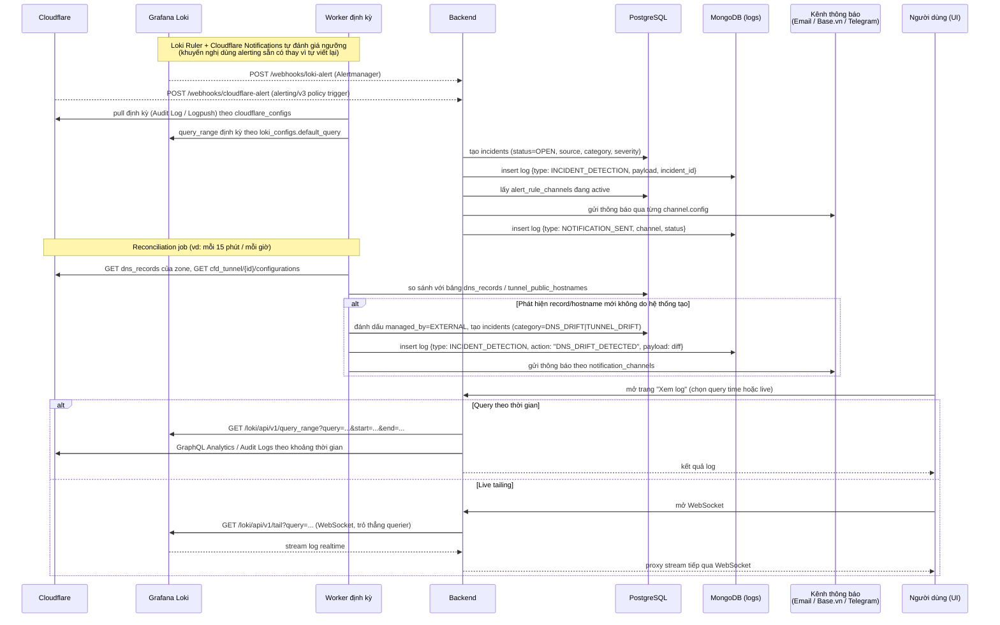
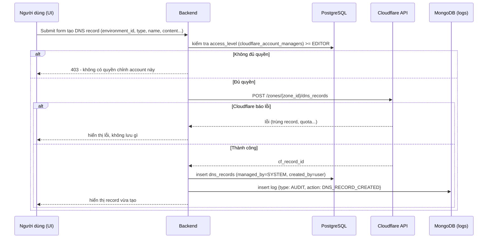

## 1. Tổng quan

Hệ thống mở rộng từ schema ITSM hiện có (PostgreSQL / SQLAlchemy Async / **UUIDv4**) — 6 bảng `users`, `roles`, `permissions`, `role_permissions`, `user_roles`, `dx_tokens` giữ **nguyên trạng, không đổi** — để quản lý thêm: dự án đa môi trường (dev/staging/production), liên kết ngoài (Jira, Git...), tích hợp xem log (Cloudflare, Grafana Loki), và cấu hình thông báo sự cố đa kênh (Email, Base.vn, Telegram...).

14 bảng mới ở mục 2 đi theo đúng quy ước đã có trong schema thật: PK/FK kiểu `uuid` (default `uuid4`), timestamp `timestamptz` với server default `now()`, secret mã hoá Fernet giống `dx_tokens`, `is_system`/`is_default`/`is_active` dùng `boolean` thay vì cho phép NULL. Đây là phần **đề xuất mở rộng**, chưa tồn tại trong migration hiện tại — cần một revision Alembic mới (xem ghi chú cuối mục 2).

Nguyên tắc phân tầng dữ liệu:

| Tầng | Công nghệ | Lưu gì | Vì sao |
|---|---|---|---|
| Quan hệ (OLTP) | PostgreSQL (nối tiếp DB hiện có) | users, projects, environments, config tích hợp, notification_channels, alert_rules, **incidents** | Cần toàn vẹn tham chiếu (FK), transaction, và các entity này có quan hệ nhiều-nhiều rõ ràng, số lượng bản ghi tăng chậm, tuyến tính theo số dự án — SQL tối ưu nhất |
| Phi quan hệ (log store) | MongoDB (document) | **logs** — gộp cả audit log (hành động người dùng) và incident log (log phát hiện sự cố + lịch sử gửi thông báo) | Ghi liên tục, khối lượng lớn, mỗi nguồn log (Cloudflare / Loki / hệ thống) có payload khác hình dạng, truy vấn chủ yếu theo khoảng thời gian — xem lý do chi tiết ở mục 4 |
| Bên ngoài (nguồn log gốc) | Cloudflare API, Grafana Loki | log gốc, không copy 100% | Hệ thống chỉ pull các sự kiện cần thiết (audit event, log khớp alert rule) về Mongo; log chi tiết đầy đủ vẫn tra cứu trực tiếp tại nguồn khi cần |

---

## 2. Sơ đồ ERD (PostgreSQL)

```mermaid
erDiagram
    users ||--o{ user_roles : "1:N (CASCADE)"
    roles ||--o{ user_roles : "1:N (RESTRICT)"
    roles ||--o{ role_permissions : "1:N (CASCADE)"
    permissions ||--o{ role_permissions : "1:N (CASCADE)"
    users ||--o| dx_tokens : "1:1 (CASCADE)"

    users ||--o{ projects : "creates (1:N)"
    projects ||--o{ project_links : "has (1:N)"
    projects ||--o{ environments : "has (1:N)"

    users ||--o{ cloudflare_accounts : "creates (1:N)"
    cloudflare_accounts ||--o{ cloudflare_account_managers : "managed by (1:N)"
    users ||--o{ cloudflare_account_managers : "manages (1:N)"
    cloudflare_accounts ||--o{ cloudflare_configs : "used by (1:N)"
    environments ||--o| cloudflare_configs : "configured with (0:1)"
    environments ||--o| loki_configs : "configured with (0:1)"

    environments ||--o{ dns_records : "manages (1:N)"
    users ||--o{ dns_records : "creates (0:N)"
    environments ||--o{ cloudflare_tunnels : "manages (1:N)"
    cloudflare_tunnels ||--o{ tunnel_public_hostnames : "publishes (1:N)"
    users ||--o{ tunnel_public_hostnames : "creates (0:N)"

    projects ||--o{ notification_channels : "has (1:N)"
    environments ||--o{ notification_channels : "scoped to (0:N)"
    environments ||--o{ alert_rules : "defines (1:N)"
    alert_rules ||--o{ alert_rule_channels : "notifies via (1:N)"
    notification_channels ||--o{ alert_rule_channels : "used in (1:N)"
    projects ||--o{ incidents : "has (1:N)"
    environments ||--o{ incidents : "occurs in (1:N)"
    alert_rules ||--o{ incidents : "triggers (0:N)"
    users ||--o{ incidents : "acknowledged by"
    users ||--o{ incidents : "resolved by"

    users {
        uuid id PK
        varchar email UK "max 320"
        varchar name "max 255"
        varchar status "Enum: ACTIVE | PENDING | BLOCKED"
        varchar external_user_id UK "nullable, max 128 (SSO DX ID)"
        varchar employee_code "nullable, max 64"
        boolean email_confirmed "default false"
        timestamptz last_login_at "nullable"
        timestamptz created_at "now()"
        timestamptz updated_at "now()"
    }
    roles {
        uuid id PK
        varchar name UK "max 100"
        boolean is_system "default false"
        timestamptz created_at "now()"
        timestamptz updated_at "now()"
    }
    permissions {
        uuid id PK
        varchar resource "max 100"
        varchar action "max 50"
        varchar description_key "max 255 (i18n key)"
    }
    role_permissions {
        uuid role_id PK, FK "-> roles.id (CASCADE)"
        uuid permission_id PK, FK "-> permissions.id (CASCADE)"
    }
    user_roles {
        uuid user_id PK, FK "-> users.id (CASCADE)"
        uuid role_id PK, FK "-> roles.id (RESTRICT)"
    }
    dx_tokens {
        uuid id PK
        uuid user_id UK, FK "-> users.id (CASCADE), 1:1 per user"
        text access_token "Fernet ciphertext"
        text refresh_token "Fernet ciphertext"
        timestamptz expires_at
        text scopes "default ''"
        timestamptz created_at "now()"
        timestamptz updated_at "now()"
    }

    projects {
        uuid id PK
        varchar name "max 255"
        text description
        uuid created_by FK "-> users.id (SET NULL)"
        timestamptz created_at
        timestamptz updated_at
    }
    project_links {
        uuid id PK
        uuid project_id FK "-> projects.id (CASCADE)"
        varchar type "Enum: JIRA | GIT | OTHER"
        varchar name "max 255"
        text url
        boolean is_default "default false"
        timestamptz created_at
        timestamptz updated_at
    }
    environments {
        uuid id PK
        uuid project_id FK "-> projects.id (CASCADE)"
        varchar type "Enum: DEV | STAGING | PRODUCTION"
        varchar name "max 100"
        text base_url
        timestamptz created_at
        timestamptz updated_at
    }
    cloudflare_accounts {
        uuid id PK
        varchar label "max 255 (tên gợi nhớ, vd: 'CF - Khách hàng A')"
        varchar cf_account_id "max 64"
        text api_token "Fernet ciphertext, dùng chung cho mọi environment gắn account này"
        uuid created_by FK "-> users.id (SET NULL)"
        timestamptz created_at
        timestamptz updated_at
    }
    cloudflare_account_managers {
        uuid cloudflare_account_id PK, FK "-> cloudflare_accounts.id (CASCADE)"
        uuid user_id PK, FK "-> users.id (CASCADE)"
        varchar access_level "Enum: OWNER | EDITOR | VIEWER"
        timestamptz created_at
    }
    cloudflare_configs {
        uuid id PK
        uuid environment_id UK, FK "-> environments.id (CASCADE)"
        uuid cloudflare_account_id FK "-> cloudflare_accounts.id (RESTRICT)"
        varchar zone_id "max 64"
        varchar zone_name "max 255"
        varchar log_source "Enum: AUDIT_LOG | LOGPUSH | GRAPHQL_ANALYTICS"
        timestamptz created_at
        timestamptz updated_at
    }
    dns_records {
        uuid id PK
        uuid environment_id FK "-> environments.id (CASCADE)"
        varchar cf_record_id UK "max 64 (ID trả về từ Cloudflare sau khi tạo)"
        varchar record_type "Enum: A | AAAA | CNAME | TXT | MX | OTHER"
        varchar name "max 255"
        text content
        boolean proxied
        integer ttl "default 1 (Auto khi proxied)"
        varchar managed_by "Enum: SYSTEM | EXTERNAL"
        uuid created_by FK "-> users.id (SET NULL), nullable khi managed_by=EXTERNAL"
        timestamptz last_synced_at
        timestamptz created_at
        timestamptz updated_at
    }
    cloudflare_tunnels {
        uuid id PK
        uuid environment_id FK "-> environments.id (CASCADE)"
        varchar cf_tunnel_id "max 64"
        varchar name "max 255"
        varchar status "Enum: HEALTHY | DEGRADED | DOWN | UNKNOWN"
        timestamptz last_synced_at
        timestamptz created_at
        timestamptz updated_at
    }
    tunnel_public_hostnames {
        uuid id PK
        uuid tunnel_id FK "-> cloudflare_tunnels.id (CASCADE)"
        varchar hostname UK "max 255"
        varchar service "max 255 (origin đích, vd: http://localhost:8080)"
        varchar managed_by "Enum: SYSTEM | EXTERNAL"
        uuid created_by FK "-> users.id (SET NULL), nullable khi managed_by=EXTERNAL"
        timestamptz last_synced_at
        timestamptz created_at
        timestamptz updated_at
    }
    loki_configs {
        uuid id PK
        uuid environment_id UK, FK "-> environments.id (CASCADE)"
        text endpoint_url
        varchar tenant_id "max 128, nullable"
        varchar auth_type "Enum: NONE | BASIC | BEARER"
        text credential "Fernet ciphertext"
        text default_query "default LogQL"
        integer default_range_minutes "default 60"
        timestamptz created_at
        timestamptz updated_at
    }
    notification_channels {
        uuid id PK
        uuid project_id FK "-> projects.id (CASCADE)"
        uuid environment_id FK "-> environments.id (CASCADE), nullable"
        varchar type "Enum: EMAIL | BASE_VN | TELEGRAM | OTHER"
        varchar name "max 255"
        jsonb config "field theo từng type, xem mục 5"
        boolean is_active "default true"
        timestamptz created_at
        timestamptz updated_at
    }
    alert_rules {
        uuid id PK
        uuid environment_id FK "-> environments.id (CASCADE)"
        varchar source "Enum: CLOUDFLARE_NATIVE | LOKI_QUERY"
        varchar cf_alert_type "max 100, nullable (dùng khi source=CLOUDFLARE_NATIVE)"
        varchar cf_policy_id "max 64, nullable (id policy tạo qua Cloudflare Alerting API)"
        jsonb condition "ngưỡng/LogQL, dùng khi source=LOKI_QUERY"
        varchar severity "Enum: LOW | MEDIUM | HIGH | CRITICAL"
        boolean is_active "default true"
        timestamptz created_at
        timestamptz updated_at
    }
    alert_rule_channels {
        uuid alert_rule_id PK, FK "-> alert_rules.id (CASCADE)"
        uuid channel_id PK, FK "-> notification_channels.id (CASCADE)"
    }
    incidents {
        uuid id PK
        uuid project_id FK "-> projects.id (RESTRICT)"
        uuid environment_id FK "-> environments.id (RESTRICT)"
        uuid alert_rule_id FK "-> alert_rules.id (SET NULL), nullable"
        varchar source "Enum: CLOUDFLARE | LOKI | MANUAL"
        varchar category "Enum: TRAFFIC | DDOS | ORIGIN_ERROR | DNS_DRIFT | TUNNEL_DRIFT | LOG_MATCH | MANUAL"
        varchar severity "Enum: LOW | MEDIUM | HIGH | CRITICAL"
        varchar status "Enum: OPEN | ACKNOWLEDGED | RESOLVED"
        varchar title "max 255"
        varchar log_ref_id "max 64 (trỏ tới _id trong Mongo logs)"
        timestamptz detected_at
        timestamptz acknowledged_at
        uuid acknowledged_by FK "-> users.id (SET NULL)"
        timestamptz resolved_at
        uuid resolved_by FK "-> users.id (SET NULL)"
        timestamptz created_at
        timestamptz updated_at
    }
```



### Giải thích các bảng mới

**projects** — một dự án, có thể nhiều environment. `created_by` dùng `SET NULL` để xoá user không kéo theo mất lịch sử dự án.

**project_links** — các liên kết ngoài của dự án (Jira, Git, hoặc loại khác về sau). Khi tạo project mới, tầng ứng dụng tự điền sẵn 2 dòng mặc định trỏ tới Jira/Git nội bộ của WeUp (`is_default = true`), người dùng có thể sửa hoặc thêm link khác — không cần bảng "default template" riêng, chỉ là giá trị khởi tạo ở tầng service.

**environments** — `type` giới hạn 3 giá trị DEV/STAGING/PRODUCTION, ràng buộc **UNIQUE (project_id, type)** để mỗi dự án chỉ có tối đa 1 environment mỗi loại.

**cloudflare_accounts / cloudflare_account_managers** — tách riêng khỏi environment vì thực tế **1 tài khoản Cloudflare có thể phục vụ nhiều dự án, và ngược lại nhiều tài khoản phục vụ nhiều dự án khác nhau** (multi-tenant, không phải 1:1). `api_token` chỉ lưu và mã hoá **một lần** ở đây, mọi environment dùng chung account chỉ tham chiếu qua `cloudflare_account_id` — không phải nhập lại token cho từng project. `cloudflare_account_managers` là lớp phân quyền theo từng account cụ thể (xem mục 8) — trả lời đúng câu hỏi "chỉ người có quyền mới được config tài khoản Cloudflare".

**cloudflare_configs** — giờ chỉ còn là **binding**: environment nào dùng account nào, zone nào. Không còn giữ token (đã chuyển qua `cloudflare_accounts`).

**loki_configs** — vẫn giữ 1:1 (0 hoặc 1) với environment vì Loki thường tách theo môi trường/hạ tầng; nếu tổ chức chỉ chạy **một cụm Loki trung tâm** cho nhiều dự án (phân biệt bằng `tenant_id` hoặc label), có thể áp dụng đúng pattern tách "account dùng chung" như Cloudflare ở trên — không bắt buộc vì đề bài chỉ nêu vấn đề chia sẻ tài khoản với Cloudflare.

**dns_records / cloudflare_tunnels / tunnel_public_hostnames** — đây là kênh **quản lý tập trung thật sự**: người dùng tạo/sửa/xoá DNS record hoặc public hostname ngay trong hệ thống, không cần mở Cloudflare dashboard. Hệ thống gọi thẳng Cloudflare API bằng token của `cloudflare_accounts` gắn với environment đó, chỉ lưu row vào bảng khi API xác nhận thành công (`managed_by = SYSTEM`, `created_by` = người tạo). Song song đó vẫn có một job đối chiếu định kỳ để phát hiện những thay đổi **không đi qua hệ thống** (`managed_by = EXTERNAL`) — vì hệ thống không thể ngăn ai đó có quyền trên Cloudflare dashboard tự sửa tay. Chi tiết cả hai luồng (tạo qua hệ thống + phát hiện lệch) ở mục 6.

`loki_configs.default_query` + `default_range_minutes` chính là phần phục vụ yêu cầu "query time" — người dùng mở trang xem log sẽ có sẵn LogQL và khoảng thời gian mặc định, chỉnh lại nếu cần. Phần "live" không lưu trong bảng này — xử lý qua proxy WebSocket ở tầng backend, xem mục 3.

**notification_channels** — đa kênh, dùng `jsonb config` vì mỗi loại kênh có field khác nhau hoàn toàn (xem mục 5), tránh phải thêm cột mỗi khi có kênh mới ("...."). `environment_id` để `NULL` nghĩa là áp dụng cho mọi environment của project.

**alert_rules / alert_rule_channels** — định nghĩa quy tắc cảnh báo theo từng environment, chia 2 nguồn: `CLOUDFLARE_NATIVE` (mirror lại một Notification Policy đã tạo bên Cloudflare, qua `cf_alert_type` + `cf_policy_id` — xem mục 7) hoặc `LOKI_QUERY` (rule tự đánh giá bằng `condition` LogQL/ngưỡng). Kênh nào được báo khi rule kích hoạt xử lý qua bảng bridge `alert_rule_channels` (nhiều-nhiều).

**incidents** — bản ghi *nghiệp vụ* của một sự cố: trạng thái OPEN → ACKNOWLEDGED → RESOLVED, ai xác nhận/đóng, và `category` để phân loại hiển thị (traffic/DDoS/lỗi origin/lệch DNS/lệch Tunnel/khớp log/thủ công) độc lập với `source` (hệ thống nào phát hiện ra). Đây là lý do incidents **vẫn nằm ở SQL** dù nội dung log chi tiết đã chuyển qua NoSQL: nó cần FK toàn vẹn tới project/environment/user và các câu query dạng "liệt kê sự cố đang mở của dự án X" — loại truy vấn có điều kiện lọc + join, SQL làm tốt hơn nhiều so với NoSQL. `log_ref_id` là con trỏ sang document bằng chứng chi tiết trong MongoDB.

### Ghi chú triển khai (khớp quy ước hiện tại)

- **Module đề xuất** (theo đúng cách tách `users`/`rbac`/`dx_core` hiện tại, bạn điều chỉnh lại tên cho khớp cấu trúc thật nếu khác): `projects` (projects, project_links, environments), `cloudflare` (cloudflare_accounts, cloudflare_account_managers, cloudflare_configs, dns_records, cloudflare_tunnels, tunnel_public_hostnames), `observability` (loki_configs, alert_rules, alert_rule_channels, incidents), `notifications` (notification_channels).
- **Alembic:** cần một revision mới nối tiếp `4ecb44cf310b` (`down_revision = '4ecb44cf310b'`), tạo cả 14 bảng — không sửa lại migration khởi tạo đã có.
- **Seed:** giống cách `RbacPermissionCatalog` đang seed sẵn permission, nên seed thêm các permission mới `cloudflare_account:manage`, `cloudflare_account:view`, `cloudflare_account:manage_all` (mục 8) vào cùng catalog đó, không tạo cơ chế seed riêng.

---

## 3. Luồng xử lý log & cảnh báo



Vài điểm cần lưu ý khi triển khai đúng như đã trace ở phần trước:

- **Live tailing** phải trỏ tới **querier** của Loki, không qua query-frontend (query-frontend không hỗ trợ WebSocket) — nếu Loki chạy scalable/microservices mode, backend cần biết endpoint querier riêng, hoặc dùng gateway (nginx) đã có sẵn rule route `/loki/api/v1/tail`.
- **Query time** dùng `query_range`, không giữ kết nối, nên chạy được qua query-frontend bình thường, tận dụng cache.
- Nên ưu tiên để **Loki Ruler/Alertmanager** và **Cloudflare Notifications** tự phát hiện & bắn webhook vào backend, thay vì backend tự polling và tự tính ngưỡng — tránh việc dựng lại một engine cảnh báo, giảm rủi ro sai số/trễ. Bảng `alert_rules` vẫn giữ vai trò lưu **mapping** rule ↔ kênh thông báo (và có thể dùng backend polling như phương án dự phòng cho môi trường chưa cấu hình được Alertmanager).
- **Reconciliation job cho DNS/Tunnel** là cơ chế bắt buộc phải có riêng — vì không có API nào của Cloudflare "chặn" việc ai đó có quyền trên dashboard tự tạo record hay publish thêm hostname; hệ thống chỉ có thể **phát hiện sau khi đã xảy ra** bằng cách so sánh định kỳ, không phải ngăn chặn trước. Muốn ngăn chặn thật sự phải xử lý ở tầng phân quyền của chính tài khoản Cloudflare (API Token scope hẹp, hạn chế ai được vào thẳng dashboard) — xem mục 8.

---

## 4. Vì sao bảng log dùng NoSQL (MongoDB) thay vì SQL

| Tiêu chí | SQL (PostgreSQL) | NoSQL (MongoDB) — lựa chọn cho `logs` |
|---|---|---|
| Tốc độ ghi | Tốt, nhưng mỗi insert kèm ghi WAL + cập nhật index trên bảng ngày càng lớn sẽ chậm dần, cần partition thủ công | Ghi append-only nhanh, thiết kế sẵn cho khối lượng ghi cao, insert không khoá bảng khác |
| Hình dạng dữ liệu | Cố định theo cột — log từ Cloudflare (CF-RAY, zone, action...), Loki (labels, log line...), audit nội bộ (actor, diff...) đều khác nhau → phải thêm nhiều cột nullable hoặc bảng EAV (chống pattern) | `payload` là document tự do, mỗi loại log giữ đúng hình dạng gốc, không ép khuôn |
| Kiểu truy vấn | Chủ yếu lọc theo `project_id/environment_id + khoảng thời gian`, gần như không cần JOIN phức tạp | Đúng sở trường: index compound `(project_id, environment_id, timestamp)`, không tốn chi phí JOIN vì không cần |
| Vòng đời dữ liệu | Log cũ cần dọn định kỳ bằng job `DELETE` — gây bloat, cần `VACUUM`, ảnh hưởng I/O bảng nghiệp vụ nếu chung DB | TTL index tự động xoá theo thời gian, không ảnh hưởng tới PostgreSQL đang phục vụ nghiệp vụ chính |
| Tách biệt rủi ro | Log lỗi bùng nổ dung lượng có thể ảnh hưởng hiệu năng bảng `incidents`, `projects`... nếu chung 1 DB | Log nằm ở cluster/DB riêng, sự cố ghi log không kéo sập nghiệp vụ chính |

### Thiết kế collection `logs`

```json
{
  "_id": "ObjectId",
  "type": "AUDIT | INCIDENT_DETECTION | NOTIFICATION_SENT",
  "project_id": "uuid (string, khớp projects.id)",
  "environment_id": "uuid (string, khớp environments.id)",
  "source": "CLOUDFLARE | LOKI | SYSTEM | USER_ACTION",
  "actor": { "user_id": "uuid (string, khớp users.id)", "email": "user@weup.vn" },
  "action": "PROJECT_CREATED | ROLE_CHANGED | 5XX_SPIKE_DETECTED | TELEGRAM_SENT",
  "severity": "INFO | LOW | MEDIUM | HIGH | CRITICAL",
  "incident_id": "uuid (string, khớp incidents.id)",
  "message": "Tóm tắt log ở dạng đọc được",
  "payload": { "...": "dữ liệu gốc theo từng nguồn, tự do" },
  "timestamp": "ISODate",
  "created_at": "ISODate"
}
```

Chỉ mục đề xuất:

- `{ project_id: 1, environment_id: 1, timestamp: -1 }` — phục vụ màn hình xem log theo dự án/môi trường/thời gian, truy vấn phổ biến nhất.
- `{ type: 1, timestamp: -1 }` — lọc riêng audit log hoặc incident log.
- `{ incident_id: 1 }` — tra toàn bộ log liên quan một sự cố (`log_ref_id` bên bảng `incidents` trỏ vào đây).
- TTL index trên `created_at`, retention gợi ý: `AUDIT` 180 ngày, `INCIDENT_DETECTION`/`NOTIFICATION_SENT` 365 ngày (có thể tách 2 giá trị TTL bằng cách set field `expire_at` tính sẵn theo `type` thay vì TTL cố định trên `created_at`, vì MongoDB TTL index áp dụng theo field, không phân biệt theo giá trị field khác).

---

## 5. Cấu hình từng kênh thông báo (`notification_channels.config`)

| Type | Field trong `config` | Ghi chú |
|---|---|---|
| `EMAIL` | `recipients: string[]` | Danh sách email nhận, không bắt buộc phải là user trong hệ thống |
| `BASE_VN` | `webhook_url, bot_name, message_template` | Base.vn dùng cơ chế **Incoming Webhook** gắn vào nhóm Base Message (tạo tại nhóm chat → Base Workflow → dán URL vào webhook job), biến `base_content` dựng từ `message_template` |
| `TELEGRAM` | `bot_token, chat_id` | Gọi Telegram Bot API `sendMessage`, `bot_token` mã hoá Fernet như các secret khác |
| `OTHER` | tự do theo kênh mới (Slack, MS Teams, SMS...) | Chừa sẵn để mở rộng mà không đổi schema |

Toàn bộ secret trong `config` (token, webhook chứa key) nên mã hoá ở tầng ứng dụng trước khi lưu jsonb, đồng nhất cách làm với `dx_tokens` và `cloudflare_accounts.api_token`.

---

## 6. DNS & Tunnel — quản lý tập trung qua hệ thống, kèm phát hiện thay đổi ngoài luồng

### 6.1 Luồng chính: tạo/sửa/xoá DNS record & public hostname ngay trong hệ thống

Đây là mục tiêu chính bạn muốn: người dùng **không cần mở Cloudflare dashboard**, làm hết trong màn hình quản lý DNS/Tunnel của hệ thống.

**Thêm DNS record:**
1. Người dùng vào environment cần thêm record, điền form (loại, name, content, proxied, TTL).
2. Điều kiện được thao tác: user phải có `access_level >= EDITOR` trên `cloudflare_accounts` đang gắn với environment đó (qua `cloudflare_configs.cloudflare_account_id` → `cloudflare_account_managers`, xem mục 8) — dùng lại đúng lớp phân quyền theo account đã thiết kế, không cần thêm bảng quyền riêng cho DNS.
3. Backend gọi `POST /zones/{zone_id}/dns_records` bằng `cloudflare_accounts.api_token` của account đó.
4. Cloudflare xác nhận thành công → lưu row vào `dns_records` (`managed_by = SYSTEM`, `created_by` = user hiện tại, `cf_record_id` = ID Cloudflare trả về).
5. Ghi audit log vào MongoDB (`type: AUDIT`, `action: DNS_RECORD_CREATED`, `actor`, `payload` = nội dung record).
6. Nếu Cloudflare trả lỗi (trùng record, vượt quota, token không đủ quyền...) → trả lỗi thẳng cho UI, **không lưu gì cả** — tránh trạng thái "tưởng có nhưng thực ra chưa tạo được". Sửa (`PATCH`) và xoá (`DELETE`) áp dụng cùng nguyên tắc: gọi Cloudflare trước, chỉ cập nhật/xoá row local khi Cloudflare xác nhận.



**Thêm public hostname qua Tunnel** — có một khác biệt kỹ thuật cần lưu ý: API cấu hình Tunnel (`PUT /accounts/{account_id}/cfd_tunnel/{tunnel_id}/configurations`) **ghi đè toàn bộ danh sách ingress rule** chứ không có endpoint thêm/sửa từng hostname riêng lẻ. Vì vậy flow là: `GET` cấu hình hiện tại → thêm/sửa/xoá rule cần thay đổi trong mảng đó ở tầng ứng dụng → `PUT` lại toàn bộ. Nếu hai người sửa cùng lúc, người sau có thể ghi đè mất thay đổi của người trước — nên khoá tạm thời (lock) theo `tunnel_id` trong lúc thao tác, hoặc kiểm tra `last_synced_at`/checksum cấu hình trước khi `PUT` để tránh ghi đè nhầm.

### 6.2 Lớp an toàn thứ hai: phát hiện thay đổi không qua hệ thống

Cho phép tạo record tập trung qua hệ thống không đồng nghĩa **chặn được** người có quyền trên Cloudflare dashboard tự tay tạo thêm — hệ thống của bạn và Cloudflare dashboard là hai cửa vào cùng một dữ liệu, chỉ có Cloudflare mới có thể chặn ở cửa của họ (siết quyền tài khoản/token, hạn chế ai được login dashboard trực tiếp — việc này thuộc về quy trình/tổ chức, không phải schema). Vì vậy vẫn giữ một job đối chiếu định kỳ làm lưới an toàn:

1. Với mỗi `environment` có `cloudflare_configs`, job gọi `GET /zones/{zone_id}/dns_records` và `GET /cfd_tunnel/{tunnel_id}/configurations`.
2. So khớp với `dns_records` / `tunnel_public_hostnames` theo `cf_record_id`/`hostname`:
   - Khớp, không đổi → cập nhật `last_synced_at`.
   - Xuất hiện mới mà hệ thống không tạo → gắn `managed_by = EXTERNAL`, tạo `incidents` (`category = DNS_DRIFT`/`TUNNEL_DRIFT`, thường severity HIGH vì đây là mở thêm bề mặt tấn công).
   - Có trong DB nhưng biến mất khỏi Cloudflare → cảnh báo mức thấp hơn (thường là bị xoá tay).
3. Ghi log diff vào MongoDB (`type: INCIDENT_DETECTION`, `action: DNS_DRIFT_DETECTED`/`TUNNEL_DRIFT_DETECTED`) để tra cứu sau.

15–30 phút/lần là tần suất hợp lý cho job này; rút ngắn riêng cho environment PRODUCTION nếu cần phát hiện nhanh hơn.

---

## 7. Cảnh báo traffic & bảo mật — dùng Cloudflare Notifications thay vì tự xây

Cloudflare có sẵn một hệ thống cảnh báo cấp account (`/accounts/{account_id}/alerting/v3/...`), nên với các vấn đề traffic/bảo mật (spike traffic, DDoS, tỷ lệ lỗi origin tăng, sự kiện bảo mật nâng cao...) hệ thống **nên đăng ký làm nơi nhận cảnh báo, thay vì tự polling rồi tự tính ngưỡng** — vừa đúng dữ liệu, vừa không phải tái tạo lại một alerting engine.

Cách tích hợp, dùng đúng các endpoint đã trace được:

1. `GET /accounts/{account_id}/alerting/v3/available_alerts` — lấy danh mục loại cảnh báo Cloudflare hỗ trợ (traffic anomaly, HTTP/L7 DDoS, origin error rate, security event nâng cao, health check...), hiển thị cho người dùng chọn khi tạo `alert_rules`.
2. `POST /accounts/{account_id}/alerting/v3/destinations/webhooks` — đăng ký **một lần cho mỗi `cloudflare_account`**, trỏ về `https://<backend>/webhooks/cloudflare-alert?account_id=...`. Đây là endpoint mà sequence diagram ở mục 3 đã vẽ (`CF-->>BE: POST /webhooks/cloudflare-alert`).
3. `POST /accounts/{account_id}/alerting/v3/policies` — mỗi khi người dùng tạo một `alert_rules` với `source = CLOUDFLARE_NATIVE`, backend gọi API này để tạo policy thật bên Cloudflare (chọn `cf_alert_type`, zone/mức áp dụng, trỏ tới webhook destination ở bước 2), lưu `policy_id` trả về vào cột `alert_rules.cf_policy_id` để sau này sửa/xoá đồng bộ hai chiều.
4. Khi sự kiện xảy ra, Cloudflare gọi vào webhook đã đăng ký → backend map `cf_alert_type` sang `incidents.category` (vd: `dos`/`http_alert_origin_error` → `DDOS`/`ORIGIN_ERROR`) → luồng tạo incident + gửi thông báo giống hệt nhánh Loki đã mô tả ở mục 3.

Ưu điểm cách này so với tự polling GraphQL Analytics rồi so ngưỡng thủ công: Cloudflare đã lo phần phát hiện DDoS/anomaly (vốn cần dữ liệu traffic real-time ở quy mô toàn mạng lưới họ, không thể tái tạo chính xác bằng cách gọi API định kỳ), hệ thống chỉ việc **định tuyến** cảnh báo đó tới đúng người qua kênh nội bộ (Base.vn/Telegram/Email) và giữ lịch sử trong `incidents`/`logs`.

Với những chỉ số không có sẵn dạng "native alert" (vd: một ngưỡng nghiệp vụ rất riêng), vẫn dùng nhánh `LOKI_QUERY` như thiết kế ban đầu — polling + tự so ngưỡng qua `alert_rules.condition`.

---

## 8. Phân quyền tài khoản Cloudflare

Đúng, cần một màn hình riêng — vì như đã tách ở mục 2, `cloudflare_accounts` không còn 1:1 với project/environment, nên phải kiểm soát ai được thấy/sửa credential của account nào. Thiết kế 2 lớp:

**Lớp 1 — cổng vào tính năng (RBAC có sẵn):** thêm 2 dòng vào bảng `permissions` đã có sẵn từ ERD gốc, ví dụ `resource = "cloudflare_account"`, `action = "manage"` và `action = "view"`. Gán quyền này cho role phù hợp (vd: `DevOps`) qua `role_permissions` — cơ chế y hệt hệ thống roles/permissions hiện tại, không cần bảng mới. Ai không có quyền `cloudflare_account:view` thì không thấy menu "Quản lý tài khoản Cloudflare" trong UI.

**Lớp 2 — phạm vi theo từng account cụ thể (`cloudflare_account_managers`):** có quyền `manage` ở Lớp 1 chỉ nghĩa là *được phép dùng tính năng này*, chưa có nghĩa là *thấy được mọi account*. Danh sách account hiển thị/sửa được với một user = giao giữa "user có mặt trong `cloudflare_account_managers` của account đó" và access_level tương ứng (`OWNER` sửa được token, `EDITOR` sửa được binding/zone nhưng không thấy token dạng plaintext, `VIEWER` chỉ xem tên/zone). Trường hợp một người cần quản lý toàn bộ account trong hệ thống (super-admin), gán role có thêm permission đặc biệt `cloudflare_account:manage_all` để bỏ qua điều kiện lọc theo `cloudflare_account_managers`.

Lý do tách 2 lớp thay vì chỉ dùng RBAC toàn cục: RBAC gốc (`roles`/`permissions`) trả lời "được làm hành động gì", còn `cloudflare_account_managers` trả lời "được làm hành động đó **trên account nào**" — đúng với tình huống bạn nêu, nhiều dự án dùng chung 1 account nhưng không phải ai quản lý dự án A cũng nên đụng được vào account đang phục vụ cả dự án B, C.

---

## 9. Tổng hợp bảng mới (PostgreSQL)

`projects`, `project_links`, `environments`, `cloudflare_accounts`, `cloudflare_account_managers`, `cloudflare_configs`, `dns_records`, `cloudflare_tunnels`, `tunnel_public_hostnames`, `loki_configs`, `notification_channels`, `alert_rules`, `alert_rule_channels`, `incidents` — 14 bảng, đi kèm 1 collection NoSQL `logs`.
