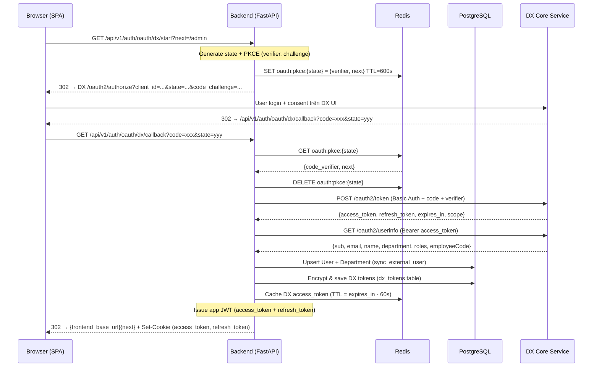

# SSO DX (WeUpBook OAuth2 + PKCE) — Luồng đầy đủ & Code Reference

> Tài liệu mô tả chi tiết luồng Single Sign-On qua **DX Core Service** (WeUpBook OAuth2 + PKCE S256),
> bao gồm sequence diagram, code thực tế từ codebase, và hướng dẫn tích hợp cho dự án mới.

---

## Mục lục

1. [Tổng quan kiến trúc](#1-tổng-quan-kiến-trúc)
2. [Sequence Diagram chi tiết](#2-sequence-diagram-chi-tiết)
3. [Cấu hình ENV](#3-cấu-hình-env)
4. [Luồng từng bước (Step-by-step)](#4-luồng-từng-bước)
5. [Code Backend (FastAPI)](#5-code-backend-fastapi)
6. [Code Frontend (React)](#6-code-frontend-react)
7. [Lưu trữ & quản lý Token](#7-lưu-trữ--quản-lý-token)
8. [Role Mapping từ DX](#8-role-mapping-từ-dx)
9. [Refresh Token & Concurrency](#9-refresh-token--concurrency)
10. [Logout & Revoke](#10-logout--revoke)
11. [Error Handling](#11-error-handling)
12. [Tích hợp cho dự án mới (Checklist)](#12-tích-hợp-cho-dự-án-mới)

---

## 1. Tổng quan kiến trúc

```
┌─────────────┐        ┌──────────────┐        ┌───────────────────┐
│   Browser   │        │   Backend    │        │  DX Core Service  │
│  (React SPA)│        │  (FastAPI)   │        │  (WeUpBook OAuth) │
└──────┬──────┘        └──────┬───────┘        └────────┬──────────┘
       │                      │                         │
       │  1. Click "Đăng nhập với DX"                   │
       │─────────────────────▶│                         │
       │                      │                         │
       │  2. 302 Redirect     │                         │
       │◀─────────────────────│                         │
       │       ┌──────────────────────────────────────▶ │
       │       │  3. User login + consent (trên DX UI)  │
       │       │◀──────────────────────────────────────│ │
       │  4. Redirect ?code=xxx&state=yyy               │
       │─────────────────────▶│                         │
       │                      │  5. POST /oauth2/token  │
       │                      │  (code + PKCE verifier) │
       │                      │────────────────────────▶│
       │                      │  6. {access_token,      │
       │                      │      refresh_token}     │
       │                      │◀────────────────────────│
       │                      │                         │
       │                      │  7. GET /oauth2/userinfo │
       │                      │────────────────────────▶│
       │                      │  8. {sub, email, name,  │
       │                      │      department, roles} │
       │                      │◀────────────────────────│
       │                      │                         │
       │  9. Set cookies +    │                         │
       │     302 → SPA        │                         │
       │◀─────────────────────│                         │
```

### Các actor

| Actor | Vai trò |
|-------|---------|
| **Browser (SPA)** | Khởi tạo SSO, nhận cookies sau callback |
| **Backend (FastAPI)** | Confidential client, giữ `client_secret`, trao đổi code, phát hành JWT session |
| **DX Core Service** | Authorization server, quản lý user identity, phát hành OAuth2 tokens |

### Đặc điểm

- **Confidential client** — Backend giữ `client_secret`, dùng HTTP Basic Auth khi gọi token endpoint
- **PKCE S256** — Chống CSRF/interception, bắt buộc dù là confidential client
- **Cookie-based session** — Backend phát hành JWT riêng (`access_token` + `refresh_token`) qua HttpOnly cookies
- **DX tokens lưu server-side** — Encrypted bằng Fernet, dùng để gọi DX API thay mặt user

---

## 2. Sequence Diagram chi tiết



---

## 3. Cấu hình ENV

```bash
# ── backend/.env ──

# DX Core Service OAuth
WEUPBOOK_API_BASE_URL=https://api-dx.weupbook.com    # Base URL của DX
WEUPBOOK_CLIENT_ID=agent-mkt                          # Client ID đăng ký trên DX
WEUPBOOK_CLIENT_SECRET=<secret>                        # Client secret (confidential)
WEUPBOOK_SCOPES=users:view fb-pages:view ad-accounts:view  # (tuỳ chọn) Scopes yêu cầu

# URL dùng để build redirect_uri cho callback
INTERNAL_API_BASE_URL=https://api-agent-mkt.agentsplatform.cloud
# → redirect_uri = {INTERNAL_API_BASE_URL}/api/v1/auth/oauth/dx/callback

# Frontend URL (redirect sau login thành công)
FRONTEND_BASE_URL=https://agent-mkt.agentsplatform.cloud

# Mã hoá DX tokens khi lưu DB
FERNET_KEY=<fernet_key>   # python -c "from cryptography.fernet import Fernet; print(Fernet.generate_key().decode())"

# JWT cho session riêng của app
JWT_SECRET=<random_40_chars>

# Cookie
COOKIE_SECURE=true              # true cho production (HTTPS)
```

### DX Endpoints (hardcoded trong code)

| Endpoint | Path | Mô tả |
|----------|------|--------|
| Authorize | `/oauth2/authorize` | Redirect browser tới đây để user login |
| Token | `/oauth2/token` | Exchange code → tokens |
| UserInfo | `/oauth2/userinfo` | Lấy profile user từ access token |
| Revoke | `/oauth2/revoke` | RFC 7009 — thu hồi token khi logout |

---

## 4. Luồng từng bước

### Step 1 — User click "Đăng nhập với DX"

Frontend gọi `loginWithDx()` → browser navigate tới backend endpoint.

### Step 2 — Backend khởi tạo OAuth flow

1. Generate `state` (random 32 bytes, URL-safe base64)
2. Generate PKCE pair: `code_verifier` (random 64 bytes) + `code_challenge` (SHA256 của verifier, base64url)
3. Lưu `{code_verifier, next}` vào Redis với key `oauth:pkce:{state}`, TTL 600s
4. Redirect browser tới DX authorize URL

### Step 3 — User xác thực trên DX

User nhập credentials trên DX UI, consent scopes → DX redirect browser quay lại callback URL kèm `?code=xxx&state=yyy`.

### Step 4 — Backend xử lý callback

1. **Validate state**: Lấy `code_verifier` từ Redis, xoá key (single-use)
2. **Exchange code**: POST tới DX `/oauth2/token` với Basic Auth + code + verifier
3. **Fetch profile**: GET `/oauth2/userinfo` với DX access token
4. **Sync user**: Upsert User + Department trong DB
5. **Save DX tokens**: Encrypt & lưu vào `dx_tokens` table
6. **Issue app session**: Tạo JWT access + refresh token riêng
7. **Redirect**: 302 về frontend + set HttpOnly cookies

---

## 5. Code Backend (FastAPI)

### 5.1. Router — Auth endpoints

> File: [`backend/app/api/v1/common/auth.py`](file:///Users/hoangdieu/PycharmProjects/agent-marketing/backend/app/api/v1/common/auth.py)

```python
# ── Bắt đầu SSO flow ──
@router.get("/oauth/dx/start")
async def oauth_dx_start(next: str | None = Query(None)):
    state = dx_oauth.generate_state()
    verifier, challenge = dx_oauth.generate_pkce()
    await cache.set_json(
        CacheKeys.oauth_pkce(state),
        {"code_verifier": verifier, "next": safe_relative_path(next)},
        ttl=600,
    )
    return RedirectResponse(dx_oauth.build_authorize_url(state, challenge), status_code=302)


# ── DX redirect callback ──
@router.get("/oauth/dx/callback")
async def oauth_dx_callback(
    db: DB,
    code: str | None = Query(None),
    state: str | None = Query(None),
    error: str | None = Query(None),
):
    login_url = f"{settings.frontend_base_url}/login"

    # 1. Validate params
    if error or not code or not state:
        return RedirectResponse(f"{login_url}?error=sso_denied", status_code=302)

    # 2. Retrieve & consume PKCE state
    stored = await cache.get_json(CacheKeys.oauth_pkce(state))
    if not stored:
        return RedirectResponse(f"{login_url}?error=sso_state", status_code=302)
    await cache.delete(CacheKeys.oauth_pkce(state))

    try:
        # 3. Exchange code for DX tokens
        token = await dx_oauth.exchange_code(code, stored["code_verifier"])

        # 4. Fetch user profile
        profile = await dx_oauth.fetch_userinfo(token["access_token"])

        # 5. Sync user into local DB
        user = await auth_service.sync_external_user(db, profile)

        # 6. Save encrypted DX tokens
        await dx_token_store.save(db, user.id, token)
    except AuthenticationError:
        return RedirectResponse(f"{login_url}?error=sso_failed", status_code=302)

    # 7. Check blocked
    if user.status in BLOCKED_STATUSES:
        return RedirectResponse(f"{login_url}?error=suspended", status_code=302)

    # 8. Update last_login
    user.last_login = local_now()
    await db.commit()

    # 9. Issue app session + redirect to SPA
    resp = RedirectResponse(
        f"{settings.frontend_base_url}{stored.get('next') or ''}",
        status_code=302,
    )
    set_auth_cookies(resp, await auth_service.issue_tokens(user))
    return resp
```

### 5.2. OAuth Module — DX HTTP calls

> File: [`backend/app/services/dx_core/oauth.py`](file:///Users/hoangdieu/PycharmProjects/agent-marketing/backend/app/services/dx_core/oauth.py)

```python
"""OAuth2 exchanges with dx-core-service: PKCE, code exchange, refresh,
userinfo and revocation. HTTP only, no database access."""

def _basic_auth() -> str:
    """HTTP Basic Auth header from client_id:client_secret."""
    raw = f"{settings.weupbook_client_id}:{settings.weupbook_client_secret}".encode()
    return "Basic " + base64.b64encode(raw).decode()


def generate_state() -> str:
    return secrets.token_urlsafe(32)


def generate_pkce() -> tuple[str, str]:
    """Return a (code_verifier, code_challenge) S256 pair."""
    verifier = secrets.token_urlsafe(64)
    challenge = base64.urlsafe_b64encode(
        hashlib.sha256(verifier.encode("ascii")).digest()
    ).decode().rstrip("=")
    return verifier, challenge


def build_authorize_url(state: str, code_challenge: str) -> str:
    params = {
        "client_id": settings.weupbook_client_id,
        "redirect_uri": settings.weupbook_redirect_uri,
        "response_type": "code",
        "state": state,
        "code_challenge": code_challenge,
        "code_challenge_method": "S256",
    }
    if settings.weupbook_scopes:
        params["scope"] = settings.weupbook_scopes
    return f"{settings.weupbook_api_base_url}/oauth2/authorize?{urlencode(params)}"


async def exchange_code(code: str, code_verifier: str) -> dict:
    """Trade an authorization code for tokens (confidential client, Basic Auth)."""
    async with httpx.AsyncClient(base_url=settings.weupbook_api_base_url) as client:
        r = await client.post(
            "/oauth2/token",
            headers={"Authorization": _basic_auth()},
            json={
                "grant_type": "authorization_code",
                "code": code,
                "redirect_uri": settings.weupbook_redirect_uri,
                "code_verifier": code_verifier,
            },
        )
        if r.status_code in (400, 401):
            raise AuthenticationError("Authorization code exchange failed")
        r.raise_for_status()
        return r.json()


async def refresh(refresh_token: str) -> dict:
    """DX rotates refresh tokens on every use."""
    async with httpx.AsyncClient(base_url=settings.weupbook_api_base_url) as client:
        r = await client.post(
            "/oauth2/token",
            headers={"Authorization": _basic_auth()},
            json={"grant_type": "refresh_token", "refresh_token": refresh_token},
        )
        if r.status_code in (400, 401):
            raise AuthenticationError("DX refresh token rejected")
        r.raise_for_status()
        return r.json()


async def fetch_userinfo(access_token: str) -> dict:
    async with httpx.AsyncClient(base_url=settings.weupbook_api_base_url) as client:
        r = await client.get(
            "/oauth2/userinfo",
            headers={"Authorization": f"Bearer {access_token}"},
        )
        r.raise_for_status()
        return r.json()


async def revoke(token: str) -> None:
    """RFC 7009. Best-effort — DX outage must not break logout."""
    try:
        async with httpx.AsyncClient(base_url=settings.weupbook_api_base_url) as client:
            await client.post(
                "/oauth2/revoke",
                headers={"Authorization": _basic_auth()},
                json={"token": token},
            )
    except Exception:
        pass  # log warning, don't fail
```

### 5.3. Config — Settings & redirect_uri

> File: [`backend/app/core/config.py`](file:///Users/hoangdieu/PycharmProjects/agent-marketing/backend/app/core/config.py)

```python
class Settings(BaseSettings):
    # ...
    weupbook_api_base_url: str = "https://api-dx.weupbook.com"
    weupbook_client_id: str = "agent-mkt"
    weupbook_client_secret: str = ""
    weupbook_scopes: str = "users:view fb-pages:view ad-accounts:view"

    @property
    def weupbook_redirect_uri(self) -> str:
        """OAuth callback — always points at the backend's own public URL."""
        return f"{self.internal_api_base_url}/api/v1/auth/oauth/dx/callback"

    @property
    def cookie_domain(self) -> str | None:
        """Parent domain so cookies are shared across subdomains.
        e.g. agent-mkt.x.cloud ↔ api-agent-mkt.x.cloud
        Returns None in local dev (browser uses request origin)."""
        host = urlparse(self.frontend_base_url).hostname or ""
        parts = host.split(".")
        if len(parts) <= 2 or host in ("localhost", "127.0.0.1"):
            return None
        return "." + ".".join(parts[-2:])
```

### 5.4. User Sync — Upsert từ DX profile

> File: [`backend/app/services/auth/auth_service.py`](file:///Users/hoangdieu/PycharmProjects/agent-marketing/backend/app/services/auth/auth_service.py)

```python
async def sync_external_user(db: AsyncSession, profile: dict) -> User:
    """Upsert local User + Department from a WeUpBook /oauth2/userinfo response.
    
    Role và status chỉ set khi tạo mới — khi admin local đã thay đổi thì
    không bị ghi đè bởi DX profile."""
    ext_department = profile.get("department")
    if not ext_department or not ext_department.get("code"):
        raise AuthenticationError("WeUpBook profile has no department")

    department = await department_service.get_or_create_by_code(
        db, code=ext_department["code"],
        name=ext_department.get("name") or ext_department["code"],
    )

    # Tìm user bằng external_user_id (sub) hoặc fallback email
    user = await db.scalar(select(User).where(User.external_user_id == profile["sub"]))
    if user is None:
        user = await db.scalar(select(User).where(User.email == profile["email"]))
    is_new = user is None

    if is_new:
        user = User(email=profile["email"], status=UserStatus.active)
        db.add(user)

    # Sync các trường từ DX
    user.external_user_id = profile["sub"]
    user.email = profile["email"]
    user.name = profile.get("name") or user.name
    user.employee_code = profile.get("employeeCode")
    user.department_id = department.id
    user.email_confirmed = bool(profile.get("emailVerified"))

    # Role chỉ set lần đầu
    if is_new:
        user.role = resolve_role(profile.get("roles") or [], department.code).value

    await db.commit()
    await db.refresh(user)
    return user
```

### 5.5. Set Auth Cookies

> File: [`backend/app/api/deps.py`](file:///Users/hoangdieu/PycharmProjects/agent-marketing/backend/app/api/deps.py)

```python
def set_auth_cookies(response: Response, tokens: dict[str, str]) -> None:
    samesite = "none" if settings.cookie_secure else "lax"
    common = {
        "httponly": True,
        "samesite": samesite,
        "secure": settings.cookie_secure,
        "path": "/",
        "domain": settings.cookie_domain,  # None for localhost, ".domain.com" for prod
    }
    response.set_cookie(
        "access_token", tokens["access_token"],
        max_age=settings.access_token_minutes * 60,  # 30 min default
        **common,
    )
    response.set_cookie(
        "refresh_token", tokens["refresh_token"],
        max_age=settings.refresh_token_days * 86400,  # 30 days default
        **common,
    )
```

---

## 6. Code Frontend (React)

### 6.1. Auth Service

> File: [`frontend/src/services/auth/authService.ts`](file:///Users/hoangdieu/PycharmProjects/agent-marketing/frontend/src/services/auth/authService.ts)

```typescript
import { api } from '@/services/api'

// SSO: Redirect browser tới backend → DX authorize
export function loginWithDx(next?: string): void {
  const query = next ? `?next=${encodeURIComponent(next)}` : ''
  window.location.href = `${api.defaults.baseURL}/auth/oauth/dx/start${query}`
}

// Get current user (cookies auto-sent)
export async function getMe(): Promise<User> {
  const { data } = await api.get<User>('/me')
  return data
}

export async function logout(): Promise<void> {
  await api.post('/auth/logout')
}
```

> [!NOTE]
> `loginWithDx` dùng `window.location.href` (full page redirect) thay vì API call, vì browser cần navigate tới DX UI để user đăng nhập.

### 6.2. AuthContext

> File: [`frontend/src/contexts/AuthContext.tsx`](file:///Users/hoangdieu/PycharmProjects/agent-marketing/frontend/src/contexts/AuthContext.tsx)

```tsx
export function AuthProvider({ children }: { readonly children: ReactNode }) {
  const [user, setUser] = useState<User | null>(null)
  const [ready, setReady] = useState(false)

  // On mount: check if already authenticated via cookies
  useEffect(() => {
    authService.getMe()
      .then((u) => setUser(u))
      .catch(() => setUser(null))
      .finally(() => setReady(true))
  }, [])

  const loginWithDx = useCallback(
    (next?: string) => authService.loginWithDx(next), []
  )

  const logout = useCallback(async () => {
    await authService.logout()
    queryClient.clear()
    setUser(null)
  }, [queryClient])

  // ...
}
```

### 6.3. Login Page (button trigger)

> File: [`frontend/src/pages/auth/Login.tsx`](file:///Users/hoangdieu/PycharmProjects/agent-marketing/frontend/src/pages/auth/Login.tsx)

```tsx
export function Login() {
  const { user, loginWithDx } = useAuth()
  const [next] = useState(() =>
    safeNextPath(new URLSearchParams(window.location.search).get('next'))
  )
  const [hasError] = useState(() =>
    new URLSearchParams(window.location.search).has('error')
  )

  function handleLoginWithDx() {
    setRedirecting(true)
    loginWithDx(next || undefined)
  }

  return (
    // ...
    <button onClick={handleLoginWithDx}>
      {t('auth.loginWithDx')}
    </button>

    {/* Error hiển thị khi callback redirect về ?error=... */}
    {hasError && <p className="text-red-500">{t('auth.ssoError')}</p>}
  )
}
```

---

## 7. Lưu trữ & quản lý Token

### Kiến trúc hai tầng token

```
┌──────────────────────────────────────────────────────────────────────┐
│                        App Session Tokens                            │
│  (JWT do backend phát hành, lưu trong HttpOnly cookies)              │
│  ┌─────────────────┐  ┌─────────────────┐                           │
│  │ access_token     │  │ refresh_token    │                           │
│  │ TTL: 30 min      │  │ TTL: 30 days     │                           │
│  │ Claims: sub,     │  │ Claims: sub,     │                           │
│  │   role, dept_id  │  │   type=refresh   │                           │
│  └─────────────────┘  └─────────────────┘                           │
└──────────────────────────────────────────────────────────────────────┘
                              ↕ dùng để authenticate API calls

┌──────────────────────────────────────────────────────────────────────┐
│                        DX Tokens (server-side)                       │
│  (Do DX phát hành, backend lưu encrypted, dùng để gọi DX API)       │
│  ┌─────────────────────────────────────────────────────┐             │
│  │ dx_tokens table (PostgreSQL)                        │             │
│  │ - access_token  (Fernet encrypted)                  │             │
│  │ - refresh_token (Fernet encrypted)                  │             │
│  │ - access_expires_at                                 │             │
│  │ - scopes                                            │             │
│  └─────────────────────────────────────────────────────┘             │
│  ┌─────────────────────────────────────────────────────┐             │
│  │ Redis cache: dx:at:{user_id}                        │             │
│  │ TTL = expires_in - 60s (skew)                       │             │
│  │ Value: {access_token, scopes}                       │             │
│  └─────────────────────────────────────────────────────┘             │
└──────────────────────────────────────────────────────────────────────┘
```

### DxToken Model

> File: [`backend/app/models/dx_token.py`](file:///Users/hoangdieu/PycharmProjects/agent-marketing/backend/app/models/dx_token.py)

```python
class DxToken(Base, UUIDMixin, TimestampMixin):
    __tablename__ = "dx_tokens"

    user_id: Mapped[uuid.UUID] = mapped_column(
        Uuid, ForeignKey("users.id", ondelete="CASCADE"), unique=True, index=True
    )
    access_token: Mapped[str] = mapped_column(Text)    # Fernet encrypted
    refresh_token: Mapped[str] = mapped_column(Text)   # Fernet encrypted
    access_expires_at: Mapped[datetime] = mapped_column(DateTime(timezone=True))
    scopes: Mapped[str] = mapped_column(Text, default="")
```

### Token Store — Save & Read

> File: [`backend/app/services/dx_core/token_store.py`](file:///Users/hoangdieu/PycharmProjects/agent-marketing/backend/app/services/dx_core/token_store.py)

```python
async def save(db, user_id, token: dict) -> None:
    """Overwrite user's DX tokens. Used on initial login AND every refresh
    (DX rotates refresh_token, so both must always be replaced together)."""
    expires_at = utc_now() + timedelta(seconds=int(token.get("expires_in", 900)))
    row = await load_row(db, user_id)
    if row is None:
        row = DxToken(user_id=user_id)
        db.add(row)
    row.access_token = encrypt(token["access_token"])
    row.refresh_token = encrypt(token["refresh_token"])
    row.access_expires_at = expires_at
    row.scopes = token.get("scope") or ""
    await db.commit()
    await write_cache(user_id, token["access_token"], row.scopes, expires_at)


async def resolve_credentials(db, user_id) -> dict:
    """Get valid DX access_token. Check Redis cache first → DB → refresh if expired."""
    cached = await read_cache(user_id)
    if cached:
        return cached  # {"access_token": ..., "scopes": ...}

    row = await load_row(db, user_id)
    if row is None:
        raise DxNotLinkedError()

    if not is_fresh(row):  # expired or within 60s skew
        return await refresh_credentials(db, user_id)

    access_token = decrypt_access_token(row)
    await write_cache(user_id, access_token, row.scopes, row.access_expires_at)
    return {"access_token": access_token, "scopes": row.scopes}
```

---

## 8. Role Mapping từ DX

> File: [`backend/app/services/auth/constant.py`](file:///Users/hoangdieu/PycharmProjects/agent-marketing/backend/app/services/auth/constant.py)

```python
EXTERNAL_ROLE_MAP: dict[str, tuple[int, Role]] = {
    "director":  (1, Role.owner),            # Giám đốc → Owner
    "manager":   (2, Role.admin),             # Quản lý → Admin
    "employee":  (3, Role.member_official),   # Nhân viên → Member
}
DEFAULT_EXTERNAL_ROLE_CODE = "employee"
ONBOARDING_DEPARTMENT_CODE_PREFIX = "DA"  # Phòng bắt đầu "DA" → member_onboard
```

### Logic ánh xạ

```python
def resolve_role(profile_roles: list[dict], department_code: str | None) -> Role:
    """Lấy role cao nhất từ DX profile (priority number thấp nhất thắng).
    Nhân viên ở phòng onboarding (DA*) → member_onboard."""
    best = None
    for entry in profile_roles:
        candidate = EXTERNAL_ROLE_MAP.get(entry.get("code"))
        if candidate and (best is None or candidate[0] < best[0]):
            best = candidate
    _, role = best or EXTERNAL_ROLE_MAP[DEFAULT_EXTERNAL_ROLE_CODE]

    if role == Role.member_official and department_code and \
       department_code.startswith(ONBOARDING_DEPARTMENT_CODE_PREFIX):
        return Role.member_onboard
    return role
```

> [!IMPORTANT]
> Role **chỉ set lần đầu** khi user mới tạo. Nếu admin local đã promote/demote user, giá trị đó sẽ **không bị ghi đè** bởi login lần sau.

---

## 9. Refresh Token & Concurrency

### Vấn đề

DX **rotate refresh token** mỗi lần dùng. Nếu 2 request concurrent cùng refresh → DX coi là token reuse → **revoke toàn bộ token chain**.

### Giải pháp: Redis Mutex

> File: [`backend/app/services/dx_core/client_helpers.py`](file:///Users/hoangdieu/PycharmProjects/agent-marketing/backend/app/services/dx_core/client_helpers.py)

```python
async def refresh_credentials(db, user_id) -> dict:
    redis = get_redis()
    lock_key = CacheKeys.dx_refresh_lock(str(user_id))  # "dx:refresh_lock:{user_id}"

    # Try acquire lock (10s TTL, NX = only if not exists)
    if not await redis.set(lock_key, "1", ex=10, nx=True):
        return await wait_for_other_refresh(db, user_id)  # Poll cache 0.1s x 100

    try:
        return await _do_refresh(db, user_id)
    finally:
        await redis.delete(lock_key)


async def _do_refresh(db, user_id) -> dict:
    row = await token_store.load_row(db, user_id)
    try:
        token = await oauth.refresh(decrypt_refresh_token(row))
    except AuthenticationError:
        await token_store.clear(db, user_id)  # Token chain revoked
        raise DxNotLinkedError("DX refresh token rejected")
    await token_store.save(db, user_id, token)  # Save new pair
    return {"access_token": token["access_token"], "scopes": token.get("scope") or ""}


async def wait_for_other_refresh(db, user_id) -> dict:
    """Other request is refreshing. Poll Redis cache every 0.1s, max 10s."""
    waited = 0.0
    while waited < 10:
        await asyncio.sleep(0.1)
        waited += 0.1
        cached = await token_store.read_cache(user_id)
        if cached:
            return cached
    raise DxNotLinkedError("Timed out waiting for DX token refresh")
```

---

## 10. Logout & Revoke

```python
# auth_service.py
async def unlink_dx(db, access_token: str | None) -> None:
    """Revoke DX token on logout. Runs BEFORE app tokens are blacklisted."""
    user_id = auth_helpers.user_id_from_token(access_token)
    if user_id is None:
        return
    row = await dx_token_store.load_row(db, user_id)
    if row is None:
        return
    await dx_oauth.revoke(decrypt_access_token(row))    # Best-effort revoke at DX
    await dx_token_store.clear(db, user_id)             # Delete from DB + Redis


async def logout(redis, access_token, refresh_token) -> None:
    """Blacklist app tokens."""
    for kind, token in (("access", access_token), ("refresh", refresh_token)):
        if token:
            payload = security.decode_token(token)
            ttl = max(int(payload["exp"]) - int(utc_now().timestamp()), 1)
            await blacklist_token(redis, kind, token, ttl)
    # Clear session cache
    if user_id:
        await cache_delete(CacheKeys.user_session(user_id))
```

### Logout sequence

1. `POST /api/v1/auth/logout`
2. Backend revoke DX token (best-effort)
3. Delete DX tokens from DB + Redis
4. Blacklist app JWT tokens
5. Delete auth cookies
6. Frontend clears React Query cache + sets `user = null`

---

## 11. Error Handling

### Callback errors (redirect về login page)

| Error param | Nguyên nhân |
|-------------|-------------|
| `?error=sso_denied` | User từ chối consent hoặc DX trả error |
| `?error=sso_state` | State không khớp hoặc đã hết hạn (CSRF protection) |
| `?error=sso_failed` | Code exchange hoặc userinfo thất bại |
| `?error=suspended` | Tài khoản bị khoá (status ∈ BLOCKED_STATUSES) |

### Frontend handling

```tsx
// Login.tsx — hiển thị lỗi khi redirect về
const [hasError] = useState(() =>
  new URLSearchParams(window.location.search).has('error')
)
// → Hiện message chung: t('auth.ssoError')
```

### Dev-only password bypass

```python
# auth_service.authenticate() — chỉ cho ENV=dev + owner email/password
if settings.env != "dev" or email != settings.owner_email or password != settings.owner_password:
    raise PermissionDeniedError("Password login disabled, use DX SSO")
```

> [!WARNING]
> Password login **chỉ hoạt động ở ENV=dev** cho owner account. Mọi môi trường khác **bắt buộc SSO DX**.

---

## 12. Tích hợp cho dự án mới (Checklist)

### Backend

- [ ] Cài thêm: `httpx`, `cryptography` (Fernet)
- [ ] Tạo config settings: `WEUPBOOK_API_BASE_URL`, `CLIENT_ID`, `CLIENT_SECRET`, `FERNET_KEY`
- [ ] Tạo `weupbook_redirect_uri` property trên Settings
- [ ] Tạo model `DxToken` (access/refresh encrypted, expires_at, scopes)
- [ ] Tạo module `services/dx_core/oauth.py` — PKCE, exchange, refresh, userinfo, revoke
- [ ] Tạo module `services/dx_core/token_store.py` — encrypt/decrypt, cache, save/load
- [ ] Tạo module `services/dx_core/client_helpers.py` — resolve_credentials + Redis mutex
- [ ] Tạo 2 endpoints: `GET /auth/oauth/dx/start`, `GET /auth/oauth/dx/callback`
- [ ] Implement `sync_external_user` — upsert User + Department từ userinfo
- [ ] Implement `set_auth_cookies` với HttpOnly, Secure, SameSite, domain
- [ ] Implement logout: revoke DX → clear DB → blacklist app JWT → delete cookies

### Frontend

- [ ] Tạo `loginWithDx(next?)` — `window.location.href` redirect
- [ ] Wire vào AuthContext
- [ ] Login page: button trigger + handle `?error=` query param
- [ ] `getMe()` on mount để restore session từ cookies

### DX Side (đăng ký trên DX Admin)

- [ ] Đăng ký client: `client_id`, `client_secret`, `redirect_uri`
- [ ] Cấu hình scopes: `users:view`, `fb-pages:view`, `ad-accounts:view` (tuỳ nhu cầu)
- [ ] Cấu hình grant types: `authorization_code`, `refresh_token`
- [ ] Cấu hình PKCE: `S256`

---

## File Reference

| File | Vai trò |
|------|---------|
| [`backend/app/api/v1/common/auth.py`](file:///Users/hoangdieu/PycharmProjects/agent-marketing/backend/app/api/v1/common/auth.py) | Router: start, callback, logout |
| [`backend/app/services/dx_core/oauth.py`](file:///Users/hoangdieu/PycharmProjects/agent-marketing/backend/app/services/dx_core/oauth.py) | HTTP calls tới DX (PKCE, exchange, refresh, userinfo, revoke) |
| [`backend/app/services/dx_core/token_store.py`](file:///Users/hoangdieu/PycharmProjects/agent-marketing/backend/app/services/dx_core/token_store.py) | Encrypt/save/cache DX tokens |
| [`backend/app/services/dx_core/client_helpers.py`](file:///Users/hoangdieu/PycharmProjects/agent-marketing/backend/app/services/dx_core/client_helpers.py) | Resolve credentials + Redis mutex refresh |
| [`backend/app/services/dx_core/constant.py`](file:///Users/hoangdieu/PycharmProjects/agent-marketing/backend/app/services/dx_core/constant.py) | DX endpoint paths + timing constants |
| [`backend/app/services/auth/auth_service.py`](file:///Users/hoangdieu/PycharmProjects/agent-marketing/backend/app/services/auth/auth_service.py) | sync_external_user, issue_tokens, logout |
| [`backend/app/services/auth/constant.py`](file:///Users/hoangdieu/PycharmProjects/agent-marketing/backend/app/services/auth/constant.py) | DX role → app role mapping |
| [`backend/app/core/config.py`](file:///Users/hoangdieu/PycharmProjects/agent-marketing/backend/app/core/config.py) | Settings: redirect_uri, cookie_domain |
| [`backend/app/core/security.py`](file:///Users/hoangdieu/PycharmProjects/agent-marketing/backend/app/core/security.py) | JWT create/decode |
| [`backend/app/api/deps.py`](file:///Users/hoangdieu/PycharmProjects/agent-marketing/backend/app/api/deps.py) | set_auth_cookies, get_current_user |
| [`backend/app/models/dx_token.py`](file:///Users/hoangdieu/PycharmProjects/agent-marketing/backend/app/models/dx_token.py) | DxToken SQLAlchemy model |
| [`backend/app/utils/crypto.py`](file:///Users/hoangdieu/PycharmProjects/agent-marketing/backend/app/utils/crypto.py) | Fernet encrypt/decrypt |
| [`frontend/src/services/auth/authService.ts`](file:///Users/hoangdieu/PycharmProjects/agent-marketing/frontend/src/services/auth/authService.ts) | loginWithDx, getMe, logout |
| [`frontend/src/contexts/AuthContext.tsx`](file:///Users/hoangdieu/PycharmProjects/agent-marketing/frontend/src/contexts/AuthContext.tsx) | AuthProvider, useAuth |
| [`frontend/src/pages/auth/Login.tsx`](file:///Users/hoangdieu/PycharmProjects/agent-marketing/frontend/src/pages/auth/Login.tsx) | Login UI + SSO button |
